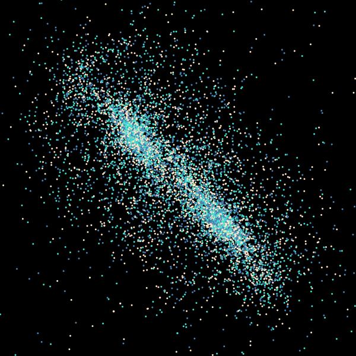

Space simulation in Java using the Barnes-Hut approximation algorithm. The basic concept of this method is to treat nearby clusters of celestial bodies as a single large body. This way, the time needed to update all bodies can be drastically reduced, since the gravitational force no longer needs to be calculated for every possible pair of bodies. Such clusters can be found using the octree data structure, where bodies are placed into nested cells of a tree according to their position. Furthermore, an interesting aspect of my implementation is the use of Morton codes to simplify insertion into the tree. The so-called Morton code or Z-curve is a special integer where each three bits correspond to the next octant in the octree.

